<picture>
  <source media="(prefers-color-scheme: dark)" srcset="./assets/banner-dark.v9.svg">
  <source media="(prefers-color-scheme: light)" srcset="./assets/banner-light.v9.svg">
  
</picture>

 

<h1 align="center">Hi 👋, I'm Guido Gentile</h1>

<h3 align="center">
Information Technology Graduate | Software Development & IT
</h3>

  🇦🇷 Argentina &nbsp;•&nbsp; 🇳🇱 Relocating to the Netherlands

---

### 👨‍💻 About Me

- 🎓 Bachelor's Degree in Information Technology
- 🇺🇸 Graduated from Florida National University
- 💻 Interested in Software Development, IT Support, Cloud & DevOps
- 🌱 Currently improving my Python and Java skills
- 🐳 Learning more about Docker, Linux and modern development tools
- 🇳🇱 Planning to relocate to the Netherlands
- 🎾 Former university tennis player

 
 

  ### 🛠️ Languages and Tools

  

 
 

### 📊 GitHub Stats

  
  

### 📫 Connect with Me

  

 

 

### 🚀 Featured Projects

<table>
<tr>

<td width="50%">

#### 🐍 Legit or Phishing (Python project by Guido Gentile)

Collection of Python projects and exercises focused on problem-solving and programming fundamentals.

**Technologies:** Python

<a href="LINK-DEL-REPOSITORIO">
  🔗 View Project
</a>

</td>

</tr>

<tr>

<td width="50%">

#### 🔐 GuidoPassKey

Password management project designed to securely generate and manage passwords.

**Technologies:** HTML

<a href="https://github.com/GuidoGentile1/GuidoPassKey">
  🔗 View Project
</a>

</td>

 

### 🌱 What I'm Currently Working On

- 🐍 Building more projects with Python
- ☕ Improving my Java skills
- 🐳 Learning Docker and DevOps fundamentals
- ☁️ Exploring Cloud technologies
- 💻 Expanding my portfolio with real-world projects

 

---

  <i>Always learning, building, and looking for new challenges.</i>

